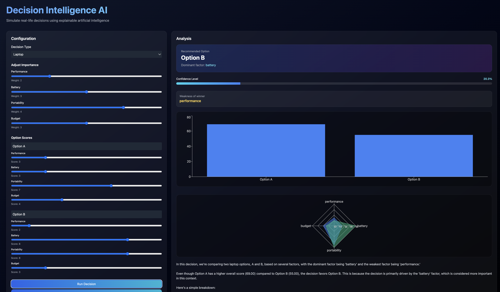
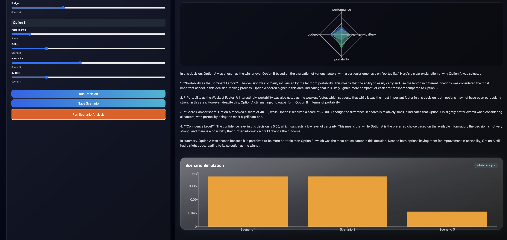
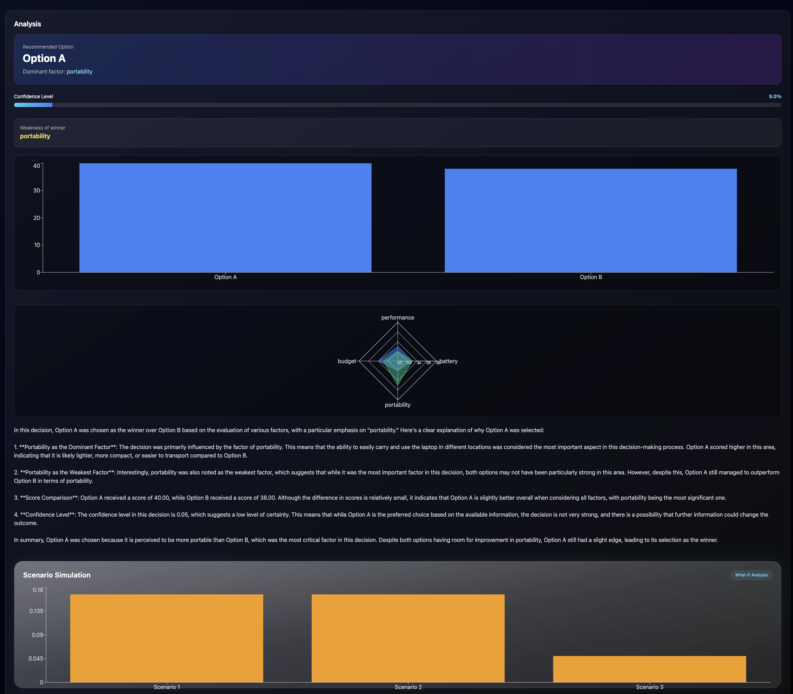

# DecisionAI: The Decision Supernova

<p align="center">
	<b>RAG-powered intelligence for real-world choices.</b><br/>
	Spring Boot precision in the backend. React velocity in the frontend.
</p>

<p align="center">
	
	
	
	
	
</p>

DecisionAI is a high-energy decision engine that transforms uncertainty into actionable recommendations. It blends retrieval-augmented generation with domain-driven scoring, giving users answers that are not only smart, but explainable.

## Why This Hits Different

- Decision-first architecture, not a generic chatbot wrapper
- Retrieval-enhanced context for grounded outputs
- Transparent criteria mapping and domain scoring
- Built for practical scenarios like laptops, life decisions, and preference trade-offs



## System Blueprint

### Backend: decisionai

- Spring Boot API for decision orchestration
- Decision engine + domain registry for modular logic
- RAG utilities with vectorization and cosine similarity
- Resource packs for scenario knowledge

### Frontend: decisionai-frontend

- React + Vite experience layer
- User preference capture and scenario prompting
- Structured recommendation presentation



## Quickstart

### 1. Clone

```bash
git clone https://github.com/ishan565/DecisionAI-RAG-GenAI-.git
cd DecisionAI-RAG-GenAI-
```

### 2. Run Backend

```bash
cd decisionai
./mvnw spring-boot:run
```

### 3. Run Frontend

Use a second terminal:

```bash
cd decisionai-frontend
npm install
npm run dev
```

## Project Structure

```text
.
├── decisionai/            # Spring Boot backend + RAG decision core
├── decisionai-frontend/   # React + Vite frontend
├── decisionai-preview-1.png
├── decisionai-preview-2.png
└── decisionai-preview-3.png
```

## Vision Orbit

This project is designed to evolve into a full decision intelligence platform: richer domain packs, stronger retrieval pipelines, and recommendation trails users can trust.



## Author

Crafted by Ishan Gupta to merge practical AI reasoning with product-grade UX.
